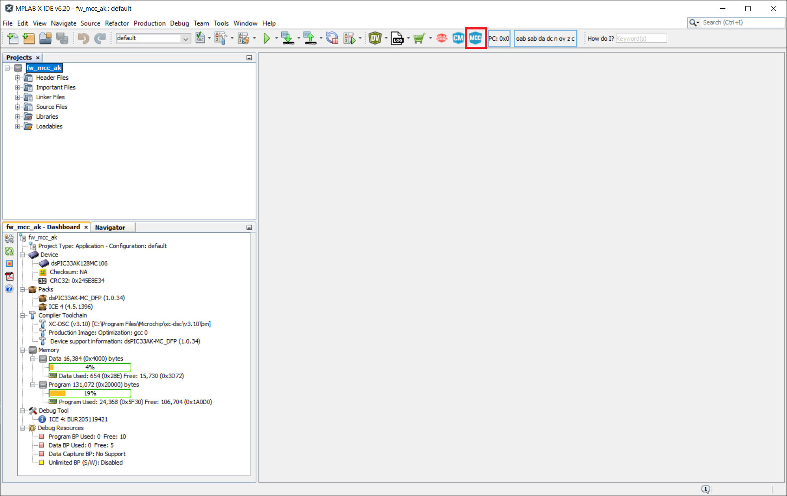
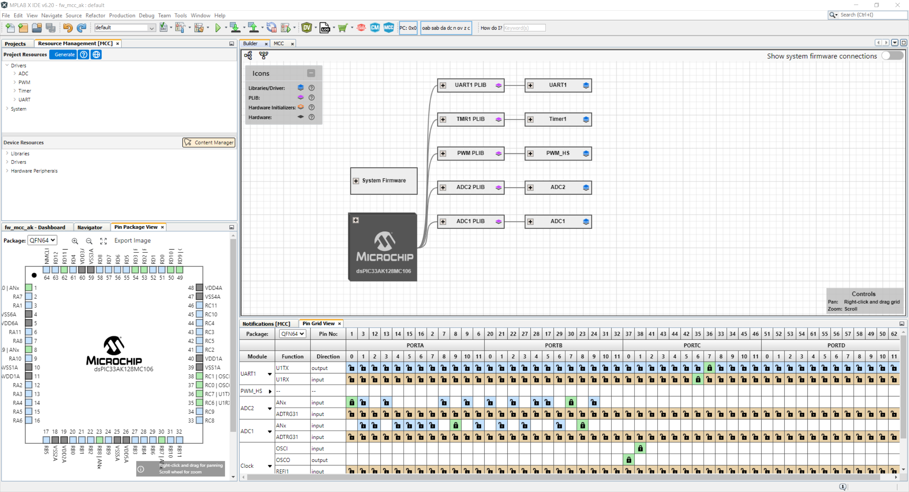
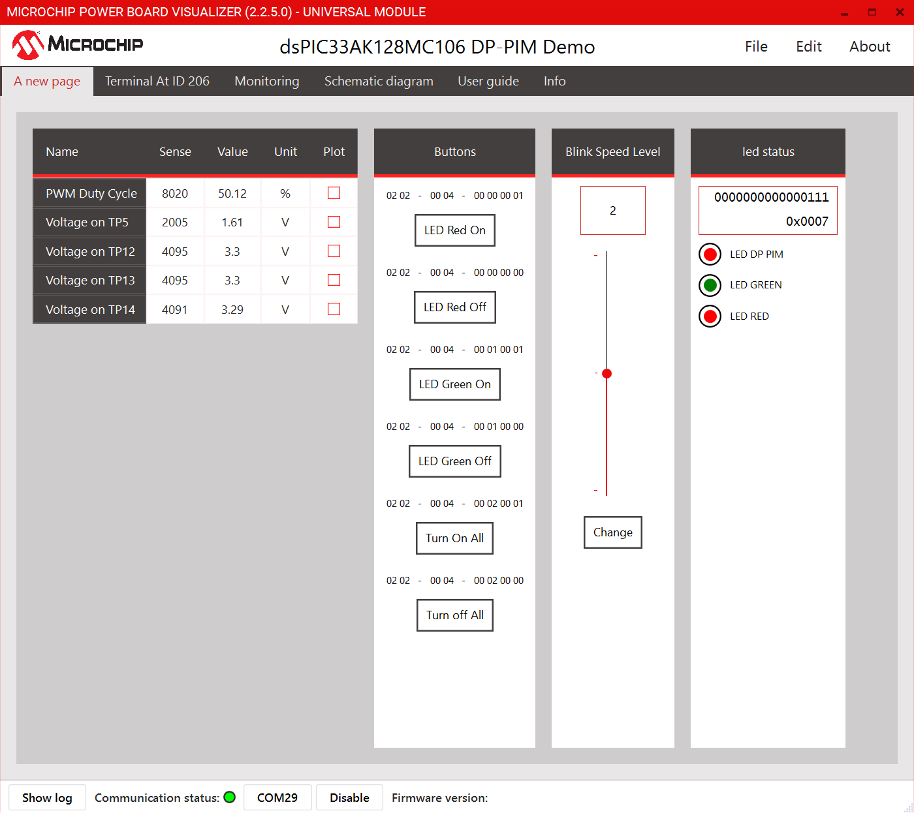

<picture>
    <source media="(prefers-color-scheme: dark)" srcset="images/microchip_logo_white_red.png">
	<source media="(prefers-color-scheme: light)" srcset="images/microchip_logo_black_red.png">
    
</picture> 

# dsPIC33AK128MC106 Digtial Power Plug In Module Software Demo

## Table of Contents
  - [Introduction/Summary](#introduction)  
  - [Related Collaterals](#related-collaterals)  
  - [Hardware Used](#hardware-used)  
  - [Software Used](#software-used)  
  - [Programming the Digital Power Development Plug in Module (DP-PIM)](#programming-hex-file-using-available-hex-files)  
  - [Software Project](#available-modes-and-recompiling)  
    - [Directory Structure](#directory-structure)  
    - [Using Microchip Code Configurator](#using-microchip-code-configurator)  
  - [Using Power Board Visualizer](#using-power-board-visualizer)  


## Introduction

The dsPIC33AK128MC106 Digital Power Plug-In Module (DP PIM) is a demonstration board that, in conjunction with different power boards, showcases the Microchip dsPIC33AK128MC106 32-Bit Digital Signal Controller (DSC) features.

The DP PIM provides access to the dsPIC33AK128MC106 analog inputs, the Digital-to-Analog Converter (DAC) output, the Pulse-Width Modulation (PWM) outputs and the General Purpose Input and Output (GPIO) ports.

This code example provides a basic peripheral setup for the ADC, PWM, UART and GPIOs using Microchip Code Configurator (MCC). 

## Related Collaterals

### Hardware Used

DSPIC33AK128MC106 Digital Power Plug-In Module([EV67K87A](https://www.microchip.com/en-us/product/dspic33ak128mc102))   
Digital power development board ([DM330029](https://www.microchip.com/en-us/development-tool/dm330029))

### Software Used 

- [MPLAB&reg; X IDE v6.20](https://www.microchip.com/en-us/tools-resources/develop/mplab-x-ide)
- [MPLAB&reg; XC-DSC Compiler v3.10](https://www.microchip.com/en-us/tools-resources/develop/mplab-xc-compilers/xc-dsc)
- [Microchip Code Configurator v5.7.1](https://www.microchip.com/en-us/tools-resources/configure/mplab-code-configurator)
- [Power Board Visualizer v2.2.5.0](https://www.microchip.com/en-us/software-library/power_board_visualizer)

**It is important to update MPLAB X IDE and MPLAB X IPE after installation for latest patches!**

**Target Device Documentation**

- [dsPIC33AK128MC108 Family](https://ww1.microchip.com/downloads/aemDocuments/documents/MCU16/ProductDocuments/ProductBrief/dsPIC33AK128MC106-Family-Product-Brief-DS70005423.pdf)
- [dsPIC33AK128MC108 Family Data Sheet](https://ww1.microchip.com/downloads/aemDocuments/documents/MCU16/ProductDocuments/DataSheets/dsPIC33AK128MC106-Family-Data-Sheet-DS70005539.pdf)
- [dsPIC33AK128MC108 Family Silicon Errata and Data Sheet Clarification](https://ww1.microchip.com/downloads/aemDocuments/documents/MCU16/ProductDocuments/Errata/dsPIC33AK128MC106-Family-Silicon-Errata-and-Data-Sheet-Clarification-DS80001139.pdf)


**Please always check for the latest data sheets on the respective product websites:**

[Back to Contents](#table-of-contents)

## Programming Hex File using available hex files

In this example ICD4 is being used, but any of the supported debuggers/programmers can be used.

1. Open MPLAB X IPE
2. Select the device on DP-PIM : dsPIC33AK128MC106
3. Connect computer to ICD4 via USB cable, connect ICD4 to J9 of the digital Power Development board via RJ11 cable.
4. Power the Board through a microUSB cable by connecting a microusb cable to J1 of the DP-PIM. 
5. Click connect on the MPLAB X IPE
6. Wait for the device to connect
7. Navigate to the folder pre_compiled_hex_files, and select the hex file.
8. Click program
9. Wait for the program/verify complete message. 
10. Disconnect programmer from Digital Power Plug-in Module.    

On successful completion of the programming, leds on the digital Power Development Board and DP PIM blink.

[Back to Contents](#table-of-contents)

## Software Project

The Demo code does the following things

1. Reads the Analog Voltage from Test Point 5(TP 5), Test Point 12(TP 12), Test Point 13(TP 13), and Test Point 14(TP14) on the Digtial Power Development Board. These analog voltages can be connected to the two potentiometers on the Development board using Jumpers, or to an external Signal Generator Using a BNC connector. 

2. Generates 100 Khz Complimentary PWM using High Speed PWM. The signals are generated on TP 45 and TP 47 on the Development Board 

3. The Analog voltage on TP5 modulates the Duty Cycle for the PWM

4. Receive and Send Data over UART from Power Board Visualizer. 

5. Toggle I/Os to blink LEDs.

### Directory Structure

The Directory structure aims to highlight the folders where the source/driver files are placed.
```
├───fw_mcc_ak.X                           dsPIC33AK128MC106 Demo MPLAB X IDE Project
├───mcc_generated_files                   This folder contains the drivers generated by the MCC Plugin of MPLAB
│   ├───adc                             
│   ├───pwm_hs
│   ├───system
│   ├───timer
│   └───uart
│───sources                               This folder contain the drivers and os that build upon the MCC drivers  
│   │   project_settings.h
│   ├───app
│   ├───config
│   ├───device
│   ├───driver
│   └───os
├───images                                Images for the Readme
├───Power Board Visualizer GUI            Power Board Visualizer Gui 
└───Pre Compiled HEX File                 Hex File that can be used directly
```

MPLAB X Integrated Development Environment (IDE) is an expandable, highly configurable software program that incorporates powerful tools to help you discover, configure, develop, debug and qualify embedded designs for Microchip Micrcontrollers and digital signal controllers. MPLAB X IDE works seamlessly with the MPLAB development ecosystem of software and tools, many of which are completely free. 

Mplab X IDE can be used to modify, debug, and build the demo .X project. 

### Using Microchip Code Configurator 

In the Latest revisions of the Microchip Code Configurator comes preinstalled. In the toolbar click on MCC to launch the MCC. 
Upon runnning for the first time, MCC downloads all the driver files, so it will take some time.



On successful opening of the project, you will see the following screen, providing a visual summary of the project, and the peripherals used.

Double Clicking on any of the Driver will open its configuration window. From here various settings can be changed. Afterwards click on generate, which will generate new files reflecting the changes. From there on, projects can be built, programmed, debugged. To learn more about the available settings, please refer to their product webpages. 



## Using Power Board Visualizer

Power Board Visualizer is a flexible Windows® tool that boosts the monitoring and debugging of embedded systems with a dsPIC33 Digital Signal Controller (DSC). It enables real-time data visualization and control through USB/UART and provides visual elements for in-depth data analysis and tracking system performance. 

Power Board Visualizer is integrated in this demo code. Install the Power Board Visualizer from the webpage. After installation, open the Power Board Visualizer Project from the folder Power Board Visualizer GUI. 


Click on COM button located on the the bottom of the interface, and select the COM port. If you do not see the COM port, make sure that the microusb is connected to the DP-PIM and not on the digital Power Development Board. Click on Enable. You will see the ADC sampled values, as well as the duty cycle of the PWM.



[Back to Contents](#table-of-contents)